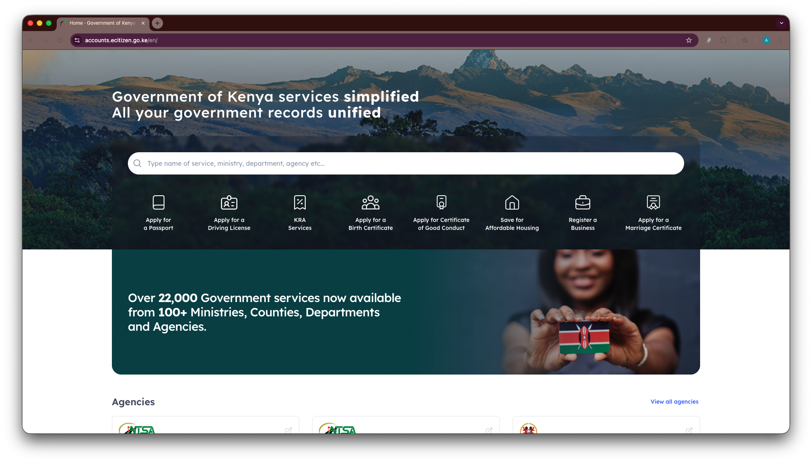

# Kenya eCitizen Services Dataset – Metadata

## 1. Overview

This document provides contextual metadata and quality analysis for the
Kenya eCitizen Services Dataset.

It supplements:

- [schema.md](/docs/schema.md) – structural schema definition
- [data_dictionary.md](/docs/data_dictionary.md) – field-level semantics
- [data_sources.md](/planning/data_sources.md) – public source URLs
- [methodology.md](/planning/methodology.md) – scraping and processing methodology
- [scope.md](/planning/scope.md) – dataset objectives and boundaries

This document focuses on:

- Dataset provenance
- Versioning context
- Coverage interpretation
- Data quality metrics
- Structural integrity validation
- Known discrepancies and limitations

## 2. Dataset Snapshot Metadata

| Attribute | Value |
|------------|--------|
| Platform | Kenya eCitizen |
| Primary URL | <https://www.ecitizen.go.ke> |
| Language | English |
| Scrape Date | 14 February 2026 |
| Scrape Method | Browser automation (Playwright) + HTML parsing |
| Python Version | 3.12 |
| Output Formats | CSV and JSON |
| Storage Structure | `data/processed/<entity>/` |
| Entities | faqs, ministries, departments, agencies, services |

This dataset represents a **point-in-time snapshot**.
Platform structure and counts may change over time.

No automated refresh process is currently implemented.

## 3. Entity-Level Coverage

### 3.1 Ministries

- **27 ministries extracted**
- **0 duplicate identifiers**
- **2 missing ministry descriptions**
- Observed agency and service counts align closely with reported values

Minor discrepancies exist between `reported_service_count`
and `observed_service_count` for a small number of ministries.
These differences are typically 1–2 services and are likely attributable
to conditional visibility or listing inconsistencies at scrape time.

Overall structural integrity: **high**

---

### 3.2 Departments

- **54 departments extracted**
- **0 duplicate identifiers**
- **2 departments missing observed_service_count**
- No missing relational identifiers

Departments without observed service counts correspond to cases where
no services were directly listed at scrape time.

Overall structural integrity: **high**

---

### 3.3 Agencies

- **286 agencies extracted**
- **0 duplicate identifiers**
- 1 agency missing:
  - description
  - logo_url
  - agency_url

The missing metadata corresponds to incomplete information
on the platform itself rather than extraction error.

Observed agency → ministry and agency → department relationships are complete.

Overall structural integrity: **high**

---

### 3.4 Services

- **5,489 services extracted**
- **0 duplicate identifiers**
- **0 missing core relational fields**
- `service_description` and `requirements` reserved for future versions (null by design)

All services contain valid:

- `service_id`
- `ministry_id`
- `department_id`
- `agency_id`
- `service_name`
- `service_url`

No orphaned services were detected.

Referential integrity validated across all relationships.

Overall structural integrity: **very high**

---

### 3.5 FAQs

- **15 FAQ entries extracted**
- **0 duplicates**
- **0 missing values**

FAQ extraction is complete relative to the public help section.

## 4. Service Coverage Analysis

The eCitizen platform publicly reports hosting **over 22,000 services**.

This dataset captures **5,489 services** that are directly listed and
discoverable through the public ministry → department → agency hierarchy.

The discrepancy likely reflects one or more of the following:

- Inclusion of transactional sub-services in the reported figure
- Form-level workflow steps counted as separate services
- Internal or dynamically generated endpoints
- Authenticated-only or context-dependent listings
- Aggregation logic used by the platform that differs from navigable listings

This dataset intentionally captures:

- Services that are publicly visible
- Services directly linked via structured navigation
- Services programmatically discoverable without authentication

Enumeration of deeper transactional endpoints or hidden navigation paths
is out of scope for this version.

### 4.4 Platform Reported Service Count

At the time of scraping, the eCitizen platform publicly displayed a
statement indicating that it hosts “over 22,000 services”.

The screenshot below captures the platform’s reported figure as observed
on 14 February 2026.

The extracted dataset includes 5,489 services that are directly discoverable
through the public ministry → department → agency navigation structure.

## 5. Data Quality Metrics

### 5.1 Duplicate Detection

Across all entities:

- No duplicate identifiers detected
- Deterministic hashing ensures internal consistency

Duplicate names across ministries, agencies, and services are handled
via hierarchical scoping in identifier generation.

---

### 5.2 Missing Data Summary

| Entity | Missing Values | Notes |
|----------|----------------|--------|
| Ministries | 2 descriptions | Absent on platform |
| Departments | 2 observed_service_count | No visible services |
| Agencies | 1 metadata record incomplete | Absent on platform |
| Services | 0 core fields | Complete |
| FAQs | 0 | Complete |

Total missing cells across entire dataset are negligible relative to size.

All missing values correspond to absent source content,
not extraction failures.

---

### 5.3 Referential Integrity

Validation checks confirmed:

- All `service.agency_id` values exist in agencies
- All `agency.department_id` values exist in departments
- All `department.ministry_id` values exist in ministries
- No orphaned records detected
- Aggregate observed counts match entity materialisation results

---

### 5.4 Identifier Stability

Identifiers are deterministic hashes of normalised strings
as defined in [methodology.md](/planning/methodology.md)

Properties:

- Reproducible within dataset version
- Sensitive to upstream name changes
- Not official government identifiers

Changes to platform naming may alter identifiers
in future dataset versions.

## 6. Known Limitations

- Dataset represents a snapshot, not a live feed
- Platform may include services not discoverable via structured navigation
- Platform-reported aggregate counts may not reflect navigable entries
- No authenticated-only content included
- No historical comparison baseline
- No automated update mechanism

## 7. Reliability Assessment

Based on:

- Zero duplicate identifiers
- Complete relational integrity
- Minimal missing values
- Deterministic ID generation
- Controlled scraping behaviour

The dataset demonstrates:

- High structural consistency
- High relational integrity
- Minimal extraction noise
- Clear traceability to source URLs

This dataset can be considered structurally robust
for research, analysis, and application development purposes.

## 8. Intended Use

The dataset is intended for:

- Research into digital government service delivery
- Platform structure analysis
- AI-assisted navigation tools
- Service discovery tooling
- Policy and digital transformation analysis

It should not be treated as an official or legally binding source.

For operational decisions, refer to the official eCitizen platform.

## 9. Versioning

This version corresponds to:

- Scrape Date: 14 February 2026
- Platform state as observed at that time
- Single complete scrape run
- No post-hoc manual editing of structured records

Future versions may:

- Expand service enumeration depth
- Extract service descriptions and requirements
- Track changes over time
- Introduce delta comparison metrics
