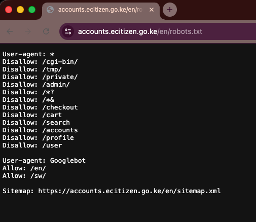

# Kenya eCitizen Services Dataset - Legal and Ethical Considerations

This document summarises the review and interpretation of relevant legal, ethical, and policy provisions applicable to the collection and publication of the Kenya eCitizen Services Dataset. It is intended to explain the decision-making process, constraints respected during scraping, and limitations of liability.

## 1. Public Accessibility and Scope

- All data collected for this dataset was obtained from **publicly accessible, unauthenticated web pages** on the Kenya eCitizen platform (`accounts.ecitizen.go.ke`).
- No authentication mechanisms (login, tokens, cookies tied to a user) were bypassed or circumvented to collect this information.
- Pages scraped were explicitly those listed on the live site’s navigation and directly accessible from menu links.

## 2. Compliance with Robots.txt

- The eCitizen `robots.txt` file was reviewed prior to scraping. Paths targeted by the scraper (e.g., ministries, agencies, public service listings) were **not listed as disallowed** in the robots directives.
- No scraping was performed against paths explicitly disallowed for all user agents. This aligns the collection process with standard crawler expectations.

## 3. Terms and Conditions

- eCitizen’s Terms and Conditions govern the use of the platform, including access, user obligations, and prohibited behaviours.
- Most government-operated portals, including eCitizen, typically include language stating that:
  - By browsing and using the site, users agree to abide by its terms.
  - The platform does not automatically collect personally identifiable data from anonymous visitors.
  - Users must not engage in unlawful activities or attempt to access restricted or private areas of the system.

**Interpretation for this dataset**:

- The dataset scrape was restricted to anonymous, publicly accessible content.
- No personal account data, user credentials, or private/insecure areas of the site were accessed.
- This approach aligns with typical terms which allow browsing and indirect data aggregation for publicly displayed content.

## 4. Privacy Policy and Personal Data

- eCitizen’s Privacy Policy outlines how the Government of Kenya collects, processes, and safeguards personal information of registered users.
- Importantly, publicly accessible informational pages (like service listings) do not require personal data entry and thus **do not involve the processing of personal data** for the purposes of this dataset.

**Implication**:

- The dataset does not include personal data; it contains metadata about services, agencies, ministries, and FAQs sourced from public pages.
- This minimises privacy risk and aligns with principles of data minimisation common in privacy frameworks.

## 5. Relevant Legal Frameworks

### Kenyan Law

- The **Computer Misuse and Cybercrimes Act** criminalises *unauthorised access* to computer systems, programmes, or data; however, scraping publicly accessible, unauthenticated web pages does *not* constitute unauthorised access under the Act.
- Kenya’s **Data Protection Act (2019)** governs the processing of personal data but does not restrict the collection of information that is already publicly and lawfully published.

### Terms Enforcement

- Government policy documents often reserve the right to modify terms unilaterally, and continued use may be treated as implied acceptance.
- This reinforces the need for a precautionary approach documented here rather than presenting this work as “endorsed” by the platform.

## 6. Ethical and Responsible Use

- The dataset is intended for research, analysis, and tooling; it is **not intended for legal advice**, regulatory compliance decisions, or any purpose requiring authoritative or up-to-date official information.
- Users must always cross-reference with the live eCitizen platform or consult legal counsel if using the data for critical decisions.
- This repository is published in good faith and for public benefit, and makes no guarantees regarding longevity, completeness, or accuracy of the underlying platform’s content.

## 7. Non-Affiliation and Attribution

- This project is an independent, third-party initiative and neither the dataset nor the code is affiliated with, endorsed by, or published on behalf of the Government of Kenya, the eCitizen platform, or any government agency.
- All source content remains the intellectual property of the original content owners.

## 8. Summary of Scraping Compliance

The scraper:

- only collected **public, unauthenticated HTML**,
- reviewed and respected `robots.txt`,
- avoided prohibited paths,
- did not process or store personal data,
- and operated within expected bounds of lawful access.
